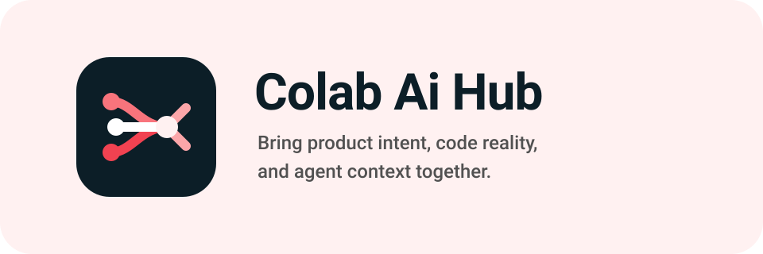
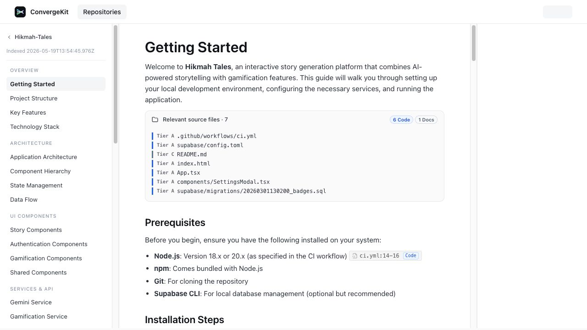
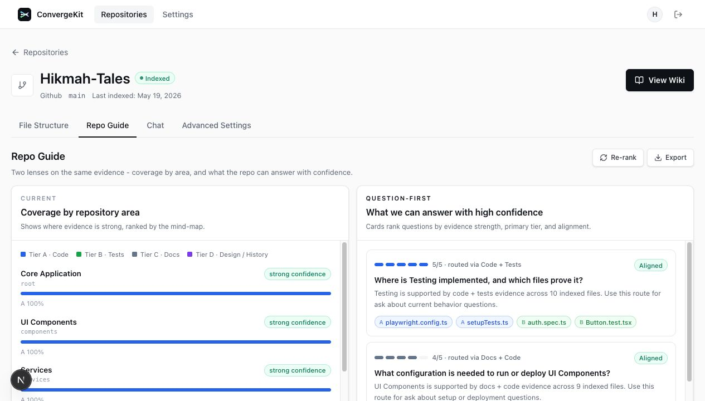
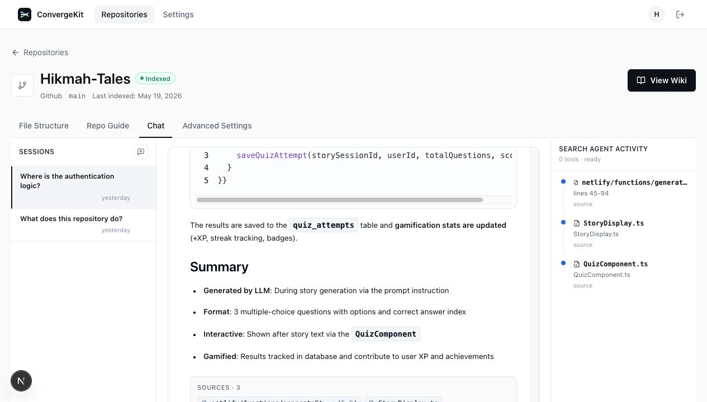
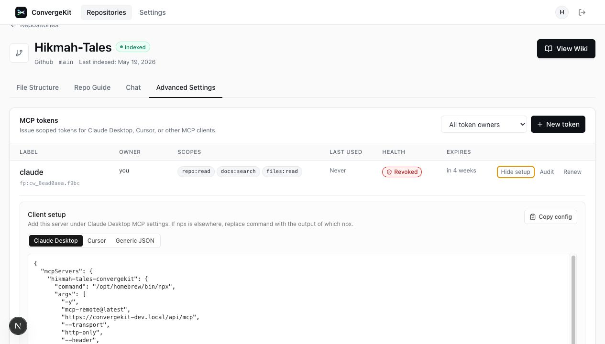

# Colab Ai Hub



Colab Ai Hub brings product intent, code reality, and agent context together.

It turns repositories into a shared evidence layer so product teams, engineers,
and AI agents can work from the same understanding. Colab Ai Hub indexes code,
classifies and ranks the files that matter, generates structured wiki content,
supports chat over repository context, and exposes repository knowledge through
a web UI, REST API, background workers, and MCP.

## The Skim

Colab Ai Hub helps an engineering organization converge around what the product
is meant to do, what the code actually does, and what AI agents need to know
before they act.

- **Index** a repository into searchable files, chunks, branches, and generated
  pages.
- **Classify** code, tests, docs, config, and product evidence into ranked
  tiers so the strongest source files rise first.
- **Rerank** evidence for each wiki page, guide question, chat answer, and MCP
  response instead of treating every match as equal.
- **Publish** the result as a wiki, repository guide, code chat, and scoped MCP
  server for tools such as Claude Desktop and Cursor.

## What It Does

- Ingests Git repositories and tracks branches, documents, chunks, classified
  evidence, and generated wiki pages.
- Uses background workers to clone repositories, chunk code, build embeddings,
  classify files, rerank evidence, and keep documentation up to date.
- Powers a Next.js web app for repository browsing, file inspection, chat, and
  wiki-style documentation.
- Exposes repository knowledge through an API and scoped Model Context Protocol
  server.
- Uses PostgreSQL, pgvector, and Redis to support search, queues, and real-time workflows.

## Screenshots

### Evidence-ranked Wiki

The wiki is generated from repository context and keeps the source evidence near
the page. Ranked files make it clear which code, tests, docs, and config back a
piece of documentation.



### Repository Guide Classification

The guide view groups the repository by functional areas, ranks source coverage,
and turns that evidence map into high-confidence questions for product and
engineering review.



### Chat With Agent Activity

Chat answers stay grounded in repository evidence. The side rail shows the
files the search agent used so humans and AI agents can audit the answer path.



### MCP Client Configuration

Repository knowledge can be exposed to external AI clients through scoped MCP
tokens. Colab Ai Hub generates client-specific setup snippets for Claude
Desktop, Cursor, and generic JSON clients.



## Quick Start

### Prerequisites

- Node.js 20+
- pnpm 9.15.0+
- Docker + Docker Compose

### Install

```bash
make install
```

### Start Local Services

```bash
make compose:setup-host
./dev.sh start
```

This starts PostgreSQL, Redis, API, worker, web, and a local HTTPS reverse
proxy. Open the app at `https://convergekit-dev.local`.

### Production-Like Local Runtime

```bash
make compose:prod
```

This builds and runs the production Dockerfiles behind the local HTTPS reverse
proxy. Use this before production-sensitive smoke tests.

### Advanced Host Runtime

```bash
make docker:up
pnpm turbo dev
```

This runs only PostgreSQL and Redis in Docker while starting the API, worker,
and web processes on the host. The default Colab Ai Hub dev flow is the
containerized stack above.

### Minimal Local Flow

1. Copy `.env.example` to `.env`.
2. Fill in required provider keys. The default local provider is OpenRouter, so
   `OPENROUTER_API_KEY` is the normal key to set.
3. Configure local HTTPS once with `make compose:setup-host`.
4. Start the hot-reload Compose stack with `./dev.sh start` or `make dev`.
5. Open the web app at `https://convergekit-dev.local`.

Local development mirrors production ingress shape: browser requests use the
single web origin (`https://convergekit-dev.local/api/...`), and the reverse
proxy routes `/api/*` to the API container.

For Workforce SSO local SAML testing, configure the Authentik SAML provider
with:

```text
ACS URL:   https://convergekit-dev.local/api/auth/workforce-saml/acs
Audience:  urn:convergekit:dev
Start URL: https://convergekit-dev.local/en/auth/sign-in
```

See [`docs/authentik-sso-setup.md`](docs/authentik-sso-setup.md) for the full
Authentik walkthrough.

To run the local smoke checks after starting the stack:

```bash
CONVERGEKIT_SMOKE_EMAIL=user@example.com CONVERGEKIT_SMOKE_PASSWORD='password' make smoke:local
```

## Core Features

- Repository analysis and incremental updates.
- AI chat over repository context using RAG.
- Auto-generated wiki pages and mind maps.
- MCP access for external AI clients.
- Shared TypeScript types across the monorepo.

## Project Structure

- `apps/web` - Next.js 15 frontend and documentation UI.
- `apps/api` - Hono API server.
- `apps/worker` - BullMQ worker process.
- `packages/db` - Drizzle schema, migrations, and queries.
- `packages/ai` - AI utilities, embeddings, and chunking helpers.
- `packages/queues` - Queue definitions and job contracts.
- `packages/auth` - better-auth configuration.
- `packages/config` - Runtime configuration and access policy parsing.
- `packages/mcp` - MCP server implementation.
- `packages/types` - Shared Zod schemas and TypeScript types.

## Commands

```bash
make dev                 # Start the full hot-reload Docker Compose dev stack
./dev.sh start           # Start the full Docker Compose dev stack
./dev.sh status          # Show Docker Compose service status
./dev.sh logs            # Tail Docker Compose logs
./dev.sh stop            # Stop the full Docker Compose dev stack
make compose:setup-host  # Add convergekit-dev.local and generate local TLS certs
make compose:dev         # Start hot-reload Docker Compose stack behind HTTPS proxy
make compose:prod        # Start production-like Docker Compose stack behind HTTPS proxy
make compose:down        # Stop the full local Docker Compose stack
make build               # Build all apps and packages
make lint                # Run ESLint across the monorepo
make test                # Run tests across the monorepo
make typecheck           # Run TypeScript checks across the monorepo
make verify              # Run public guard scripts, tests, typecheck, lint, and build
make clean               # Remove build outputs and node_modules

make docker:up           # Start PostgreSQL + Redis
make docker:down         # Stop Docker Compose services
make docker:logs         # Tail Docker Compose logs

make db:generate         # Generate Drizzle migrations
make db:migrate          # Apply pending database migrations
make db:studio           # Open Drizzle Studio

make worker:start        # Start the worker process only
```

## Architecture

The repo is organized as a Turborepo monorepo with three main apps and shared
packages.

- `apps/web` handles the user-facing interface.
- `apps/api` provides the HTTP API, auth, and MCP endpoints.
- `apps/worker` handles long-running repository processing jobs.
- PostgreSQL stores repository and documentation data.
- Redis backs queues, caching, and event delivery.

For more detail, see:

- [Functional Requirements](specs/functional-requirements.md)
- [Technical Specifications](specs/technical-specifications.md)
- [Architecture Analysis](specs/analysis-of-approach.md)

## Environment Variables

The sample environment lives in [`.env.example`](.env.example). At minimum, a
local or deployed environment needs:

- `DATABASE_URL`
- `REDIS_URL`
- `BETTER_AUTH_SECRET`
- `BETTER_AUTH_URL`
- `WEB_APP_URL`
- `NEXT_PUBLIC_API_URL`

Depending on the features you enable, you may also need provider keys. The
default provider is OpenRouter, so `OPENROUTER_API_KEY` is the normal key for
local chat, indexing, embeddings, and wiki generation.

### Workforce SSO (Authentik)

Colab Ai Hub uses [Authentik](https://github.com/goauthentik/authentik) as its
workforce SSO identity provider over SAML 2.0. Enable it with
`WORKFORCE_SSO_ENABLED=true` and the `WORKFORCE_SAML_*` variables described in
[`docs/authentik-sso-setup.md`](docs/authentik-sso-setup.md). When enabled,
email/password sign-in is disabled and users sign in through Authentik.

`compose.authentik.yaml` runs Authentik alongside the stack if you do not
already have one — `make authentik:up` starts it on `http://localhost:9000`.
Bootstrap the first admin through GitHub before enabling SSO (`INITIAL_ADMIN_EMAIL`
plus the sign-in page's **Admin** tab); admins are GitHub-linked by design, and
until one exists every SSO sign-in is refused with `bootstrap_admin_required`.

### Access Policy

Colab Ai Hub can restrict who can sign in and which repositories can be indexed
through deployment configuration:

| Env var                          | Default      | Purpose                                                                                      |
| -------------------------------- | ------------ | -------------------------------------------------------------------------------------------- |
| `ACCESS_ALLOWED_EMAIL_DOMAIN`    | unset        | When set, allows only user/admin email addresses ending in this domain.                      |
| `ACCESS_ALLOWED_GITHUB_ORG`      | unset        | When set, restricts admin GitHub organization access and repository ownership to this org.   |
| `ACCESS_ALLOWED_REPOSITORY_HOST` | `github.com` | Allows only repositories from this Git host.                                                 |

If the email domain or GitHub organization is unset, that restriction is not
applied. Existing users and repositories are not migrated or deleted when these
values change. Policy values are read at process startup, so deployment changes
require restarting or redeploying the API/auth runtime.

## Deployment

Colab Ai Hub ships as standard Docker images for the web, API, worker, and database
migration workloads. This repository does not prescribe a cloud provider.

At minimum a deployment needs:

- PostgreSQL 16 with pgvector.
- Redis 7 or compatible.
- A public web origin.
- API, web, worker, and migration containers built from this repository.
- Runtime secrets for auth, GitHub OAuth, encryption, and selected AI providers.

Use the local Compose files as the reference for required services and
environment variables.

## Contributing

Contributions are welcome. See [CONTRIBUTING.md](CONTRIBUTING.md) for local
development and pull request expectations.

## License

Colab Ai Hub is released under the MIT License. See [LICENSE](LICENSE).
